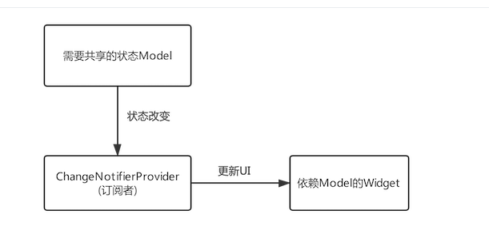

### 知识点：
1.导航返回拦截 WillPopScope. 
2.数据共享 InheritedWidget.
3.跨组件状态共享。
4.颜色与主题。
5.按需rebuild（ValueListenableBuilder）。
6.异步UI更新（FutureBuilder、StreamBuilder）。
7.对话框详解。

目标：理解数据共享、跨组件状态共享、异步UI更新。其他的用到时再看即可。

##### 2、数据共享 （InheritedWidget）
InheritedWidget是 Flutter 中非常重要的一个功能型组件，它提供了一种在 widget 树中从上到下共享数据的方式，比如我
们在应用的根 widget 中通过InheritedWidget共享了一个数据，那么我们便可以在任意子widget 中来获取该共享的数据！
这个特性在一些需要在整个 widget 树中共享数据的场景中非常方便！如Flutter SDK中正是通过 InheritedWidget 来共享应
用主题（Theme）和 Locale (当前语言环境)信息的。

##### 3、跨组件状态共享（Provider）

Model变化后会通知ChangeNotifierProvider(订阅者)，ChangeNotifierProvider 内部会重新构建 InheritedWidget，
而依赖该InheritedWidget的子孙Widget就会更新。

##### 4.颜色与主题
1)
//根据背景色亮度来确定Title颜色
color: color.computeLuminance() < 0.5 ? Colors.white : Colors.black,

2)
Color(0xffdc380d); //如果颜色固定可以直接使用整数值
//颜色是一个字符串变量
var c = "dc380d";
Color(int.parse(c,radix:16)|0xFF000000) //通过位运算符将Alpha设置为FF
Color(int.parse(c,radix:16)).withAlpha(255)  //通过方法将Alpha设置为FF

3)主题：
ThemeData用于保存是Material 组件库的主题数据，Material组件需要遵守相应的设计规范，
而这些规范可自定义部分都定义在ThemeData中了，所以我们可以通过ThemeData来自定义应用主题。
在子组件中，我们可以通过Theme.of方法来获取当前的ThemeData。

##### 6、FutureBuilder、StreamBuilder
很多时候我们会依赖一些异步数据来动态更新UI，比如在打开一个页面时我们需要先从互联网上获取数据，
在获取数据的过程中我们显示一个加载框，等获取到数据时我们再渲染页面；又比如我们想展示Stream（比如文件流、
互联网数据接收流）的进度。当然，通过 StatefulWidget 我们完全可以实现上述这些功能。但由于在实际开发中依赖异步数据
更新UI的这种场景非常常见，因此Flutter专门提供了FutureBuilder和StreamBuilder两个组件来快速实现这种功能。

##### 7、对话框详解

  